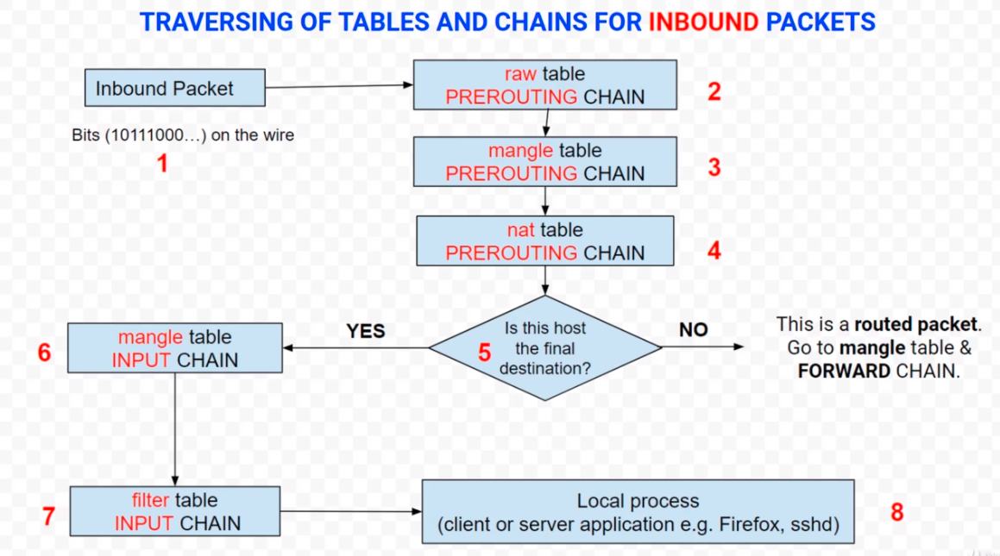
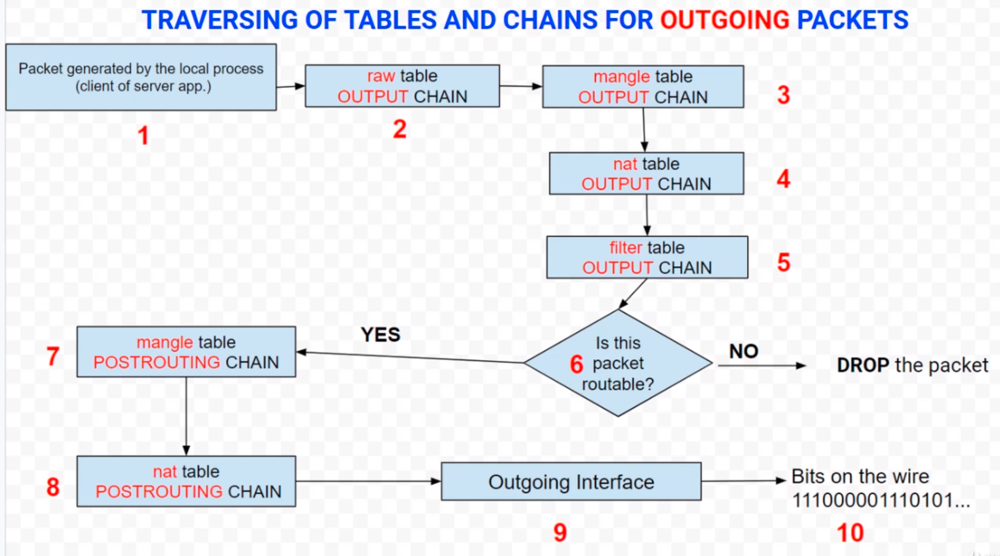
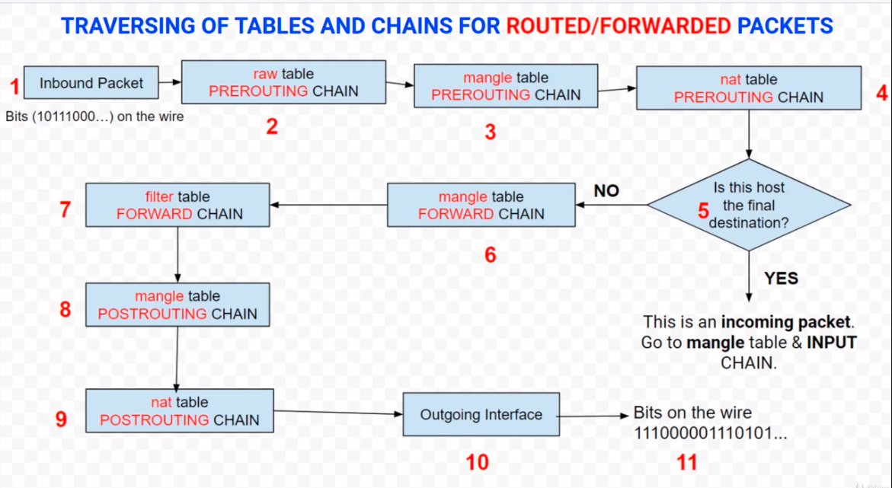

**Why** creating notes on iptables these days?   
kube-proxy *uses* iptables, so I have decided to do a refresh on the topic.

- [iptables](#iptables)
  * [Kernelspace](#kernelspace)
  * [Userspace](#userspace)
  * [Options](#options)
  * [General info](#general-info)
    + [Command Types](#command-types)
    + [Table Types](#table-types)
    + [Chain Names](#chain-names)
    + [Matches](#MATCHES)
  * [Examples](#Examples)
    + [List](#list)
      + [List from filter table](#List-from-filter-table)
      + [List from nat table](#List-from-nat-table)
      + [List from raw table](#List-from-raw-table)
      + [List from mangle table](#List-from-mangle-table)
    + [Allow](#allow)
      + [Allow any website OUTGOING traffic on port 443](#Allow-any-website-OUTGOING-traffic-on-port-443)
      + [Allow OUTGOING traffic by multi PORT](#Allow-OUTGOING-traffic-by-multi-PORT)
      + [Allow OUTGOING and INCOMING traffic via loopback interface](#Allow-OUTGOING-and-INCOMING-traffic-via-loopback-interface)
      + [Allow OUTGOING traffic by interface](#Allow-OUTGOING-traffic-by-interface)
      + [Allow OUTGOING ssh connection from the machine](#Allow-OUTGOING-ssh-connection-from-the-machine)
      + [Allow INCOMING traffic by interface](#Allow-INCOMING-traffic-by-interface)
      + [Allow INCOMING traffic using TCP syn flag](#Allow-traffic-using-TCP-syn-flag)
      + [Allow INCOMING traffic using TCP flags](#Allow-INCOMING-traffic-using-TCP-flags)
      + [Allow INCOMING traffic in a specific time](#Allow-INCOMING-traffic-in-a-specific-time)
      + [Allow INCOMING traffic with number of connections per IP address](#Allow-INCOMING-traffic-with-number-of-connections-per-IP-address)
      + [Allow INCOMING ICMP traffic using LIMIT MATCH](#Allow-INCOMING-ICMP-traffic-using-LIMIT-MATCH)
    + [DROP](#block)
      + [Drop INCOMING traffic to IP Addr](#Drop-INCOMING-traffic-to-IP-Addr)
      + [Drop INCOMING traffic to a range of IP using iprange](#Drop-INCOMING-traffic-to-a-range-of-IP-using-iprange)
      + [Drop INCOMING traffic on port 443 EXCEPT on specific IP](#Drop-INCOMING-traffic-on-port-443-EXCEPT-on-specific-IP)
      + [Drop INCOMING ssh traffic by PORT](#Drop-INCOMING-ssh-traffic-by-PORT)
      + [Drop INCOMING traffic by MAC Address](#Drop-INCOMING-traffic-by-MAC-Address)
      + [Drop OUTGOING traffic to a subnet](#Drop-OUTGOING-traffic-to-a-subnet)
      + [Drop OUTGOING traffic to a site](#Drop-OUTGOING-traffic-to-a-site)
      + [Drop OUTGOING traffic by address type](#Drop-OUTGOING-traffic-by-address-type)
      + [Drop OUTGOING traffic by QUOTA](#Drop-OUTGOING-traffic-by-QUOTA)
    + [FORWARD](#forward)
      + [Allow FORWARD packets in a specific time](#Allow-FORWARD-packets-in-a-specific-time)
      + [Create blacklist with recent BLOCKED connections](#Create-blacklist-with-recent-BLOCKED-connections)
    + [Zero Counters](#zero-counters)
    + [Flush](#flush)
      + [Clean rules in all chains in filter table](#clean-rules-in-all-chains-in-filter-table)
      + [Clean rules in the INPUT chain in filter table](#Clean-rules-in-the-INPUT-chain-in-filter-table)
      + [Clean rules in all chains in nat table](#Clean-rules-in-all-chains-in-nat-table)
    + [Chains](#Chains)
      + [Create a chain](#create-a-chain)
      + [Change default policy for a chain](#CHANGE-DEFAULT-POLICY-FOR-A-CHAIN)
      + [Delete a created chain](#delete-a-created-chain)
      + [Delete a rule in a chain](#DELETE-A-RULE-IN-A-CHAIN)
      + [Insert a rule on TOP of the chain](#Insert-a-rule-on-TOP-of-the-chain)
  * [Conntrack module and Stateful Firewall](#Conntrack-module-and-Stateful-Firewall)
    + [Allow INCOMING traffic state ESTABLISHED RELATED](#Allow-INCOMING-traffic-state-ESTABLISHED-RELATED)
    + [Allow OUTGOING traffic in initialized connections state NEW ESTABLISHED RELATED](#Allow-OUTGOING-traffic-in-initialized-connections-state-NEW-ESTABLISHED-RELATED)
    + [Drop INVALID packets](#Drop-Invalid-packets)
  * [ipset](#ipset)
    + [Blocking via hash ip](#Blocking-via-hash-ip)
    + [Using hash net to block large nets](#Using-hash-net-to-block-large-nets)
    + [List sets](#List-sets)
    + [Delete entry in set](#Delete-entry-in-set)
    + [Flush all sets](#Flush-all-sets)
    + [Flush a specific set](#Flush-a-specific-set)
    + [Delete a set](#Delete-a-set)
    + [Setting the maximal number of elements which can be stored in a set](#Setting-the-maximal-number-of-elements-which-can-be-stored-in-a-set)
    + [Auto BLOCK attemps to a specific port](#Auto-BLOCK-attemps-to-a-specific-port)
    + [Blocking an entire country](#Blocking-an-entire-country)
  * [Targets](#Targets)
    + [Terminating Targets vs Non Terminating](#Terminating-Targets-vs-Non-Terminating)
    + [REJECT](#REJECT)
    + [LOG](#LOG)
    + [TEE](#TEE)
    + [REDIRECT](#REDIRECT)
  * [TCP and UDP Ports states](#TCP-and-UDP-Ports-states)
    + [Open Port](#Open-Port)
    + [Close Port](#Close-Port)
    + [Filtered and Stealth](#Filtered-and-Stealth)
  * [User Defined Chains](#User-Defined-Chains)
  * [SNAT or MASQUERADE](#NAT-or-MASQUERADE)
  * [DNAT](#DNAT)
  * [Chain Traversal in Depth](#Chain-Traversal-in-Depth)
    + [Incoming Packets](#Incoming-Packets)
    + [Outgoing Packets](#Outgoing-Packets)
    + [Routed and Forward Packets](#Routed-Packets)
  * [Load Balance Example](#Load-Balance-Example)
  * [Scanners](#Scanner)
    + [nmap](#nmap)
  * [RESET Cleaning firewall](#RESET-Cleaning-firewall)
  * [Resources](#Resources)

# iptables

- The userspace tool requires: `privileged user`
- All commands executed via iptables are stored in memory, if the machine is rebooted the changes are lost.
- `iptables-save` will output the rules in stdout or file
- `iptables-restore` loads rules from a file in memory
- `0/0` means any network and any mask

To save the current rules running in memory:  

**RedHat**:  
```# service iptables save```

## Kernelspace
See `netfilter`

## Userspace
See `iptables` command

## Options
`-j` — Jumps to the specified target when a packet matches a particular rule. Valid targets to use after the -j option include standard options (ACCEPT, DROP, QUEUE, and RETURN) as well as extended options that are available through modules loaded by default with the Red Hat Enterprise Linux iptables RPM package, such as LOG, MARK, and REJECT, among others. Refer to the iptables man page for more information about these and other targets.

## General info

General command is:  
`iptables [-t TABLE] COMMAND CHAIN_NAME MATCHES -k TARGET/JUMP`

### Table Types
**filter**  
This is the default and perhaps the most widely used table. It is used to make decisions about whether a packet should be allowed to reach its destination.
iptables filter table has the following built-in chains: `INPUT, OUTPUT, FORWARD`

**nat**  
The nat table is specialized for `SNAT` and `DNAT` (`Port-Forwarding`)
This table allows you to route packets to different hosts on `NAT` (`Network Address Translation`) networks by changing the source and destination addresses of packets. It is often used to allow access to services that can’t be accessed directly, because they’re on a NAT network.
iptables NAT table has the following built-in chains: `PREROUTING, POSTROUTING and OUTPUT` (for locally generated packets)

**mangle**  
This table allows you to alter packet headers in various ways, such as changing TTL values.
mangle table has the following built-in chains: `PREROUTING, INPUT, FORWARD, OUTPUT, POSTROUTING`

**raw**  
The raw table is only used to set a mark on packets that should not be handled by the connection tracking system. This is done by using `NOTRACK`
target on packet. raw table has the following builtin-chains: `PREROUTING and OUTPUT`.

### Command Types
**-A** - Append the rule to the end of selected chain                                                             
**-I** - Insert one or more rules in the selected chain  on specific position, by default on the top (position 1)  
**-L** - List all rules in the selected chain. If no chain is selected all chains as listed                       
**-F** - Flush (`CLEAN`) the selected chain. If no chain is selected, all chains are `CLEANED`                               
**-D** - Delete one or more rules from the selected chain
**-R** - Replace rule in a selected chain                                                         
**-S** - Show all rules in the selected chain
**-Z** - Zero the packet and byte counters. If no chain is specified all chains counters are clean                
**-N** - Create a new user defined chain by the given name                                                        
**-X** - Delete the user-defined chain specified                                                                  
**-P** - Set the policy for the built-in chain (INPUT, OUTPUT or FORWARD)                                         
**-v** - Verbose output
**-n** - Avoid long reverse DNS lookup. Print IPs instead of domains and service names.

### Chain Names
**INPUT**  - used for filtering `INCOMING PACKETS`. In our linux host is the `packet DESTINATION`  
**OUTPUT** - used for filtering `OUTGOING PACKETS`. In our linux host is the `packet SOURCE` of the packet  
**MASQUERADE** -  
**FORWARD** -  
**PREROUTING** - used for `DNAT/Port Forwarding`  
**POSTROUTING** - used for `SNAT (MASQUERADE)`  
**USER_DEFINED** -  

### Matches
**-s** - source_ip              
**-d** - dest_ip                
**-o** - outgoing_int           
**-p** - protocol               
**--sport** - source port       
**--dport** - destionation port 
**-i** - incoming int           
**-m** - mac                    
**-m** - time                   
**-m** - quota                  
**-m** - limit                  
**-m** - recent                 

## Examples
### List
#### List from filter table
```
# iptables -Lnv INPUT
```

#### List from mangle table
```
iptables -t mangle -Lvn
```

#### List from raw table
```
iptables -t raw -Lvn
```

#### List from nat table
```
iptables -t nat -Lvn
```

### Allow
#### Allow OUTGOING traffic to any website on port 443
```
# iptables -I OUTPUT -p tcp --dport 443 -d 0/0 -j ACCEPT
```

#### Allow OUTGOING traffic by multi PORT
```
# iptables -A OUTGOING -p tcp -m multiport --dports 80,443 -j ACCEPT
```

##### Allow INCOMING traffic by interface
Available for: INPUT, FORWARD and PREROUTING chains

Example 1:
```
# iptables -A INPUT -i wlan1 -j ACCEPT
```

Example 2: Allow `any wlan` interface, like `wlan0`, `wlan1`, `wlan2` etc
```
# iptables -A INPUT -i wlan+ -j ACCEPT
```

#### Allow OUTGOING traffic by interface
```
# iptables -A OUTPUT -o eth0 ACCEPT
```

#### Allow OUTGOING ssh connection from the machine
From the machine I am writing this iptables rule, Allow ssh to any machine via 22 port.
```
# iptables -A OUTPUT -p tcp --dport 22 -j ACCEPT
```

#### Allow OUTGOING and INCOMING traffic via loopback interface
It's always a good practice allow INCOMING and OUTGOING communication via loopback interface.

- `-i` incoming interface
- `-o` outgoing interface

```
# iptables -A INPUT -i lo -j ACCEPT
# iptables -A OUTPUT -o lo -j ACCEPT
```

#### Allow INCOMING traffic using TCP syn flag
```
# iptables -A INPUT -i eth0 -p tcp --syn -s 192.168.10.1 -j ACCEPT
```

#### Allow INCOMING traffic using TCP flags
Usage `--tcp-flags mask comp`

`mask` is the flags which we should examine, written as a comma-separate list
`comp` is a comma-separate list of flags which must be set

FLAGS:

- `SYNC`: Synchronize
- `ACK`: Acknowledgement
- `FIN`: Finalize
- `RST`: Reset
- `URG`: Urgent
- `PSH`: Push
- `ALL`: All tcp flags
- `NONE`: None tcp flags

```
# logging outgoing traffic that has syn and ack set
iptables -A OUTPUT -p tcp --tcp-flags syn,ack,rst,fin syn,ack -j LOG
```

#### Allow INCOMING traffic in a specific time
Options available:
```
# iptables -m time --help

time match options:
    --datestart time     Start and stop time, to be given in ISO 8601
    --datestop time      (YYYY[-MM[-DD[Thh[:mm[:ss]]]]])
    --timestart time     Start and stop daytime (hh:mm[:ss])
    --timestop time      (between 00:00:00 and 23:59:59)
[!] --monthdays value    List of days on which to match, separated by comma
                         (Possible days: 1 to 31; defaults to all)
[!] --weekdays value     List of weekdays on which to match, sep. by comma
                         (Possible days: Mon,Tue,Wed,Thu,Fri,Sat,Sun or 1 to 7
                         Defaults to all weekdays.)
    --kerneltz           Work with the kernel timezone instead of UTC
```

Example:
```
# iptables -A INPUT -p tcp --dport 22 -m time --timestart 10:00 --timestop 15:00 -j ACCEPT
# iptables -A INPUT -p tcp --dport 22 -j DROP
```

#### Allow INCOMING traffic with number of connections per IP address
Useful to avoid **DDoS attacks**

- `--connlimit-upto` **n**: match if the number of existing connections is less than n
- `--connlimit-above` **n**: match if the number of existing connections is greater then n

```
# iptables -A INPUT -p tcp --dport 25 --syn -m conlimit \
        --connlimit-above 5 -j REJECT --reject-with tcp-rst
```

#### Allow INCOMING ICMP traffic using LIMIT MATCH
Allow INCOMING ICMP traffic (echo-request) as 7 packages (doesn't matter how fast it was) and after
that LIMIT 1 packet PER SEC
```
# iptables -A INPUT -p icmp --icmp-type echo-request -m limit --limit 1/sec \
          --limit-burst 7 -j ACCEPT
# iptables -A INPUT -p icmp --icmp-type echo-request -j DROP
```

### Drop
#### Drop INCOMING traffic to a range of IP using iprange
Drop range from 192.168.1.20 to 192.168.1.25
```

# iptables -I INPUT -p tcp --dport 25 -m iprange --src range 192.168.1.20-192.168.1.25 -j DROP
```
#### Drop INCOMING traffic to IP Addr
```
# iptables -I INPUT -s 192.168.1.20 -j DROP
```

#### Drop INCOMING ssh traffic by PORT
```
# iptables -A INPUT -p tcp --dport 22 -j DROP
```

#### Drop INCOMING traffic by MAC Address
```
# iptables -A INPUT -i wlan0 -m mac --mac-source 08:00:11:22:44:11:22 -j DROP
```

#### Drop INCOMING traffic on port 443 EXCEPT on specific IP
Use the `!` operator.

```
# iptables -A INPUT ! -s 192.168.1.50 -p tcp --dport 443 -j DROP
```

#### Drop OUTGOING traffic to a subnet
```
# iptables -I OUTPUT -s 192.168.0.0/24 -j DROP
```

#### Drop OUTGOING traffic to a site

User can do a single line, like this one:
```
# iptables -I OUTPUT -d www.terra.com.br -j DROP
```

**Or Block** by IPs address manually assigned to the site:
```
$ dig www.terra.com.br
;; ANSWER SECTION:
www.terra.com.br.	60	IN	CNAME	www.terra.com.br.edgesuite.net.
www.terra.com.br.edgesuite.net.	7199 IN	CNAME	a1799.dscb.akamai.net.
a1799.dscb.akamai.net.	19	IN	A	104.98.115.161
a1799.dscb.akamai.net.	19	IN	A	104.98.115.145

# iptables -I OUTPUT -d 104.98.115.161 -j DROP
# iptables -I OUTPUT -d 104.98.115.145 -j DROP
```

However, **both approaches won't work** for sites like **google**, **facebook** can have several IPs address but only list a few of them here. In that case, is required to have a proxy like squid in front of the your subnet.

#### Drop OUTGOING traffic by address type
Address type:  
- UNSPEC, UNICAST, LOCAL, BROADCAST, ANYCAST  
- MULTICAST, BLACKHOLE, UNREACHABLE, PROHIBIT  
- THROW, NAT, XRESOLVE

```
# iptables -A OUTPUT -m addrtype --dst-type MULTICAST -j DROP
``` 

#### Drop OUTGOING traffic by QUOTA

quota is defined in `bytes`

```
1 KB = 2^10 = 1024 bytes
1MB  = 1024K
1G   = 1024M
```

```
1M   = 1000000
10M  = 10000000
100M = 100000000
1G   = 1000000000
```

```
# iptables -A OUTPUT -d 80.0.0.1 -p tcp --sport 80 -m quota quota 1000000000 -j ACCEPT
# iptables -A OUTPUT -d 80.0.0.1 -p tcp --sport 80 -j DROP
```

### Zero Counters
List data  
```
# iptables -Lvn
```

Zero everything  
```
# iptables -F
```

List data  
`# iptables -Lvn`  

### FORWARD

The FORWARD chain is only applied when the machine is a router.  

Consider FORWARD as packets that are neither emitted by the host
nor directed to the host. They are the packets that the host is merely routing.

#### Allow FORWARD packets in a specific time
Accepting forwarded traffic (this is the router machine) 
to www.uol.com.br on workdays between 18:00-08:00
```
# iptables -A FORWARD -p tcp --dport 80 -d www.uol.com.br -m time \
    --weekdays Mon,Tue,Wed,Thu,Fri --timestart 18:00 --timestop 8:00 -j ACCEPT
```
 
Packets to www.ubuntu.com are dropped between 8:00 - 18:00 (working hours)
```
# iptables -A FORWARD -p tcp --dport 80 -d www.uol.com.br -j DROP
```

#### Create blacklist with recent BLOCKED connections

Read this NOTE AFTER)
-------------------------
Package that must be ROUTED (FORWARD) must be inspected by this rule
checking if the source ip address belongs to the `badguys list` and
if in the list it will be dropped. It will create a quite time of `60 seconds`
until another packet of this source ip will be considered.
```
# iptables -A FORWARD -m recent --name badguys --update --seconds 60 -j DROP
```

Read here FIRST)
--------------------
DROP traffic if the packets come from interface `eth0`, protocol `tcp` and destination port is `8080` 
and the blacklist is create via `/proc/net/xt_recent/badguys` adding the source IP address from this
packet into the list.
```
# iptables -A FORWARD -p tcp -i eth0 --dport 8080 -m recent --name badguys --set -j DROP
```

Additional data:
- `--name` create a list in which the source IP address will be added and checked
- `--set` adds the source IP address to the list
- `--update` checks if the source IP address is in the list and updates the "last seen time"
- `--rcheck` checks if the source IP address is in the list and **DOESNT UPDATE** the "last seen time"
- `--seconds` used with `--update` or `--rcheck`. Matches the packet only if the source IP address is in the list and the last seen time valid

### Flush
#### Clean rules in all chains in filter table
Flush all rules in `all chains` in the `filter table`  
```
# iptables -F
# iptables -Lvn
```

#### Clean rules in the INPUT chain in filter table
Flush all rules in `INPUT` chain in the `filter table`  
```
# iptables -F INPUT
# iptables -Lvn
```

#### Clean rules in all chains in nat table
Flush all rules in `INPUT` chain in the `nat table`  
```
# iptables -t nat -F
# iptables -Lvn
```

### Chains
#### Create a Chain
```
# iptables -N MYCHAIN
# iptables -Lvn
```

#### Change Default Policy For a Chain
Example each packet which is not accepted for a rule, will drop.

```
# iptables -P FORWARD DROP
# iptables -Lvn
```


#### Delete a Created Chain
```
# iptables -X MYCHAIN
# iptables -Lvn
```

#### Delete a Rule in a Chain
Delete the rule number 3 in INPUT chain

```
# iptables -D 3 INPUT
# iptables -Lvn
```

### Insert a rule on TOP of the chain
- `-I` will insert in the `TOP` of the chain.  
- On the other hand, `-A` will `APPEND` the rule.

```
# iptables -I INPUT -p tcp --dport -s 192.168.1.10 -j ACCEPT
# iptables -I INPUT -p tcp --dport -j DROP
```
## Conntrack module and Stateful Firewall
The conntrack module, basically is a connection tracking or stateful firrewall.

- NEW: The first packet from a connection
- ESTABLISHED: Packets that are part of an existing connection
- RELATED: Packets that are requesting a new connection and are already part of an existing connection. (EX: FTP)
- INVALID: Packets that are not part of any existing connection
- UNTRACKED: Packets marked within the raw table with the NOTRACK target

Conntrack module can even be used in non tracking protocol like UDP or ICMP

- `-m state --state` *state* where state is comma separed values of packet states

### Allow INCOMING traffic state ESTABLISHED RELATED
```
# iptables -A INPUT -m state --state ESTABLISHED,RELATED -j ACCEPT
```

### Allow OUTGOING traffic in initialized connections state NEW ESTABLISHED RELATED
```
# iptables -A OUTPUT -m state --state NEW,ESTABLISHED,RELATED -j ACCEPT
```

### Drop INVALID packets
```
# iptables -A INPUT -m state --state INVALID -j DROP
# iptables -A OUTPUT -m state --state INVALID -j DROP
```

## ipset
- The iptables doesnot provide support for matching multiple separate addresses or networks in one rule.
- ipset is an extension to iptables that allow us to create firewall rules that match entire `sets` of addresses at once
- Unlike iptables chains, which are stored in traversed linerarly, IP sets are stored in `indexed data structures`m
  making lookups `very efficient`, even when dealing with large sets.
- ipset let you create huge lists of ip addresses and/or ports, with tens of thousands of entries, which are
  stored in a tiny piece of RAM with extreme efficiency.

### Blocking via hash ip
Example, imagining blocking a bunch of IPs in iptables, example (require 3 commands):
```
# iptables -A INPUT -s 1.1.1.1 -j DROP
# iptables -A INPUT -s 2.2.2.2 -j DROP
# iptables -A INPUT -s 8.8.8.8 -j DROP
```

1. Now start with ipset, `creating new set`:
```
# ipset -N MYNEWSET hash:ip
```

2. Add subnets to new set
```
# ipset -A MYNEWSET 1.1.1.1
# ipset -A MYNEWSET 2.2.2.2
# ipset -A MYNEWSET 8.8.8.8
```

3. Use in the iptables with -m set
Incoming traffic `matching the SOURCE` from the list of set `MYNEWSET` and DROP
```
# iptables -A INPUT -m set --match-set MYNEWSET src -j DROP
```

4. New list the iptables rules, you will notice ONLY ONE SINGLE rule. Without the ipset it will require a BUNCH of IPTABLES RULES to match it
```
# iptables -Lvn
```

### Using hash net to block large nets
```
# ipset -N brazil hash:net
# ipset -N china hash:net

# ipset -A china 1.0.0.0/8
# ipset -A china 2.0.0.0/8
# ipset -A china 3.0.0.0/8
```

### List sets
```
# ipset -L
# ipset -L brazil
# ipset -L china
```

### Delete entry in set
```
# ipset del china 1.0.0.0/8
```

### Flush all sets
```
# ipset -F
```

### Flush a specific set
```
# ipset -F china
```

### Delete a set
```
# ipset destroy china
```

### Setting the maximal number of elements which can be stored in a set
Default value: `65535`

```
# ipset create myset1 hash:ip maxelem 2048
```

### Auto BLOCK attemps to a specific port
```
# ipset -N auto_blocked iphash
# iptables -I INPUT -p tcp --dport 80 -j SET --add-set auto_blocked src

NOTE: It's the same as manually adding via:
# ipset -A auto_blocked 1.2.3.4

Now time to add a rule to block:
# iptables -I INPUT -m set --match-set auto_blocked src -j DROP
```

## RESET Cleaning firewall
```
# iptables -P INPUT ACCEPT
# iptables -P OUTPUT ACCEPT
# iptables -P FORWARD ACCEPT

# iptables -t filter -F
# iptables -t raw -F
# iptables -t nat -F
# iptables -t mangle -F

# iptables -X

# ipset -F
# ipset -X
```

### Blocking an entire country
```
#!/bin/bash
 
echo "### BLOCKING CHINA ###"
# Check if the file exists (in the current directory) and if yes, remove it
if [ -f "cn-aggregated.zone" ]
then
    rm cn-aggregated.zone
fi
 
# Download the aggregate zone file for China
wget http://www.ipdeny.com/ipblocks/data/aggregated/cn-aggregated.zone
 
 
# Check if there was an error
if [ $? -eq 0 ]
then
    echo "Download Finished!"
else
    echo "Download Failed! Exiting ..."
    exit 1
 
fi
 
# Creating a new set called china of type hash:net (nethash)
ipset -N china hash:net -exist
 
# Flushing the set
ipset -F china
 
# Iterate over the Networks from the file and add them to the set
echo "Adding Networks to set..."
for i in `cat cn-aggregated.zone`
do
    ipset -A china $i
done
 
# Adding a rule that references the set and drops based on source IP address
echo -n "Blocking CN with iptables ... "
iptables -I INPUT -m set --match-set china src -j DROP
echo "Done"
```

## Targets
### Terminating Targets vs Non Terminating
When a packet match a rule, will have to targets:

- Terminating TARGETS: `ACCEPT` or `DROP`  
This means when a packet match a rule that contains `ACCEPT` or `DROP` it will execute
the rule and **STOP** going into the list of rules after in the CHAIN as it matched the rule.

- Non Terminating TARGETS: `LOG` or `TEE`  
This means that if a packet match a rule with `LOG` or `TEE` it will continue executing
the rules and **NOT** stop executing the rules in the CHAIN.

Examples:  

**Terminating Action**  

In this case, it will accept the packet on port 22 and terminate. 
No more rules will be read. Like the DROP connection.
```
# iptables -F
# iptables -A INPUT -p tcp --dport 22 -j ACCEPT
# iptables -A INPUT -p tcp -j DROP
```

**Non Terminating Action**  

It will log the packet INCOMING in port 22 and continue into the list
of rules. In this case, drop the packet.  
```
# iptables -F
# iptables -A INPUT -p tcp --dport 22 -j LOG
# iptables -A INPUT -p tcp -j DROP
```

The LOG can be seen via `dmesg` command as it uses Linux Kernel facility.

### REJECT
- REJECT is a terminating target 
- Like DROP it denies the packet **but also sends back a reply packet** to the source
- By default it sends back an **ICMP Port Unreacheable** packet.
- It's possible to change the response packet using **--reject-with** option
- Sometimes it's more efficient to REJECT than DROPPING the packet

Examples:

```
# iptables -I INPUT -p tcp --dport 22 -s 192.168.0.20 -j REJECT
# tcpdump host 192.168.0.20

<on machine 192.168.0.20>
# nmap -p 22 192.168.0.10
```


```
# iptables -I FORWARD -p udp --dport 69 -j REJECT --reject-with icmp-port-unreachable
```

### LOG
- LOG is a **non terminating** target
- It logs detailed information about packets headers
- Logs can be read with `dmesg` or from `syslogd daemon`
- LOG is used instead of DROP in the debugging phase
- ULOG has MYSQL support (extensive logging)

**options**
- `--log-prefix`
- `--log-level`

Example:
```
# iptables -A INPUT -p tcp --dport 22 --syn -j LOG --log-prefix="incoming ssh:" --log-level info
# dmesg | grep "incoming ssh" 
```

### TEE
- The `TEE` target will clone a packet and redirect this clone to another machine on the local subnet
- It is used for traffic mirroring

Examples:

```
# iptables -A INPUT -p icmp --icmp-type echo-request -j TEE --gateway 10.0.0.10
```

```
# iptables -A FORWARD -i eth0 -o eth1 -p tcp -d 80.0.0.1 -j TEE --gateway 10.0.0.10
```

NOTE: 10.0.0.10 is the IP address that will receive the mirror traffic.

### REDIRECT
- Used to redirect packets from one port to another on the same machine
- The Redirect target is extremely good to use for transparent proxying, where the
  LAN host do not know about the proxy at all
- REDIRECT target is only valid whithin the PREROUTING and OUTPUT chains of the **nat** table

Examples:
```
# iptables -t nat -A PREROUTING -p tcp --dport 123 -j REDIRECT --to-ports 22
```

```
# iptables -t nat -A PREROUTING -p tcp --dport 80 -j REDIRECT --to-ports 8080
```

## TCP and UDP Ports states
### Open Port
  - There is an application that's listening on a OPEN port. We can communicate with that application.
  - An OPEN port responds back to the source
  - We can list open ports using `netstat` command

### Close Port
  - There is no application that's listening on a CLOSED port
  - A closed port respond too, with TCP Reset for TCP traffic and with ICMP Port Unreachable, for UDP traffic

### Filtered and Stealth
  - A firewall is dropping any packet. The port **can be OPEN or CLOSED on the host**, but we can't communicate with it
  - A filtered port **doesn't respond back**.

## Scanners
### nmap

**TCP Scans**  

- SYN Scans: -sS (root only)  

	It can be perform quickly, it's STEALTH mode as it never complete TCP connection.  
	Also know as `Half open scanning`, because it never open TCP connection.  

	A **SYN response** means the port is `OPEN` and a `RESET` indicates the port is **CLOSED**.
	If **no response** is received the port is marked as **FILTERED**.

- Connect Scan: -sT 

- UDP Scan: -sU
- ICMP Scan: -sN or -sP

Example:
```
# nmap -sS -p 22,100 -sV 192.168.0.1
```

## User Defined Chain
- By default, the iptables **filter** table consist of three built-in chains: **INPUT**, **OUTPUT** and **FORWARD**
- You can add as many custom (user-defined) chains as you like to help simplify managing large rules sets
- User-defined chains are useful in optimizing the ruleset. They allow the rules to be organied categories.
- From a built-in chain using **-j CUSTOM-CHAIN** you can jump into a custom chain
- After the user-defined chain is traversed, control returns to the calling built-in chain, and matching
  continues from the next rule in the calling chain, unless the user-defined chain matched and took
  a terminating action on the packet.
- The **RETURN** target in the rule of a custom-chain makes processing resume back in the chain that
  called the custom chain
- **-j RETURN** can also be used inside built-in chain. In this case no other rule will be 
  inspected and packet executes the default POLICY
- If you want stop using your custom chain temporarily, you can simply **delete the jump from
  the INPUT chain** (rather than flushing or deleting the entire custom chain)

**Options**:

```
-N NEW_CHAIN creates a new user-defined chain
-L NEW_CHAIN lists the content of the chain
-X NEW_CHAIN deletes the custom-chain (it must be empty before using -F)
-F NEW_CHAIN flush ALL rules from the chain
```

Example 1:
```
# creating a user-defined chain
iptables -N TCP_TRAFFIC
 
# add rules to the chain
iptables -A TCP_TRAFFIC -p tcp -j ACCEPT
 
# jump to the chain from the input chain
iptables -A INPUT -p tcp -j TCP_TRAFFIC
 
# flush all rules in the chain
iptables -F TCP_TRAFFIC
 
# delete the chain
iptables -X TCP_TRAFFIC
```

Example 2:
```
!/bin/bash
 
# flushing all chains
iptables -F
 
# deleting all user-defined chains
iptables -X
 
# allow all outgoing traffic (except invalid packets)
iptables -A OUTPUT -m state --state NEW,ESTABLISHED,RELATED -j ACCEPT
 
 
# allow incoming ssh packets
iptables -A INPUT -p tcp --dport 22 -j ACCEPT
iptables -A OUTPUT -p tcp --sport 22 -j ACCEPT
 
 
#create a new chain named ACCEPTED_MAC
iptables -N ACCEPTED_MAC
 
#add rules to the user defined-chain
iptables -A ACCEPTED_MAC -m mac --mac-source B8:81:98:22:C7:6B -j ACCEPT
iptables -A ACCEPTED_MAC -m mac --mac-source B8:81:98:22:C6:7C -j ACCEPT
iptables -A ACCEPTED_MAC -m mac --mac-source B8:81:98:22:23:AB -j ACCEPT
iptables -A ACCEPTED_MAC -m mac --mac-source B8:81:98:22:67:AA -j ACCEPT
 
 
# jump from the INPUT chain to the user-defined chain
# now packets traverse the iptables rules in the user-defined chain
iptables -A INPUT -j ACCEPTED_MAC
 
#if not dropped or accepted (terminating target) packets continue traversing the INPUT chain
iptables -A INPUT -p icmp -j ACCEPT
iptables -A OUTPUT -p icmp -j ACCEPT
 
 
iptables -P OUTPUT DROP
iptables -P INPUT DROP
```

## SNAT or MASQUERADE
- NAT involves **re-writing the source/or destination addresses** of IP packets as they pass through a router or firewall
- **SNAT replaces** the private IP address from the packet with the public IP address of the router external interface
- Netfilter framework enables a Linux machine with an appropriate number of network cards (interface) to become a router
  capable of NAT
- SNAT uses **nat table** and the **POSTROUTING** chain
- **MASQUERADE** is a special case of SNAT used when the public IP address of the NAT Router is dynamic. It will
  automatically use the IP address of the outgoing network interface for network translation
- When uses SNAT or MASQUERADE the netfilter also performs port address translation (PAT) on the packet.

**Setting**:
1. Enable the routing process

```
# echo "1" > /proc/sys/net/ipv4/ip_forward
```

or add the following and restart the network service

```
# vi /etc/sysctl.conf
net.ipv4.ip_forward=1
``` 

2. Add an iptables rule to **nat table** and **POSTROUTING chain** that matches packets that should be
NATed, specify the external interface using **-o** option and use **-j SNAT --to-source PUBLIC_IP** or
**-j MASQUERADE** targets

```
# echo "1" > /proc/sys/net/ipv4/ip_forward
# iptables -t nat -A POSTROUTING -s 10.0.0.0/24 -o eth0 -j MASQUERADE
```  

### DNAT
- It permits connections from the Internet to servers with private IP addresses inside LAN
- The client connects to the PUBLIC IP address of the DNAT Router which internally
  will redirects the traffic to the private server
- The server with the private IP address stays invisible
- DNAT uses nat table and PREROUTING chain
- Target used is -j DNAT --to-destination private_ip_address

Examples:
```
# iptables -t nat -F  PREROUTING
# iptables -t nat -A PREROUTING -p tcp --dport 80 -j DNAT --to-destination 10.0.0.2
# iptables -t nat -A PREROUTING -p tcp --dport 8080 -j DNAT --to-destination 10.0.0.2:80
```

## Chain Traversal in Depth
### Incoming Packets
A packet can be found in one of following scenarios:

1. It comes from the network and is destined for our host, which is the final destination
**PREROUTING -> INPUT**

2. It comes from the network but its not destined for our host. The packet must be routed by
   the Linux Machine.

**PREROUTING -> FORWARD -> POSTROUNTING**

3. It is generated by an application on the host

**PREROUTING -> OUTPUT -> POSTROUTING**

Additional data:

`raw table` - add rules to skip connection track system
`mangle table` - change packet headers, example TOS, TTL
`nat table` - network translation or port forward


*graph crated by: Andrei Dumitrescu*

### Outgoing Packets

*graph crated by: Andrei Dumitrescu*

### Routed Packets

*graph crated by: Andrei Dumitrescu*

## Load Balance Example
```
#!/bin/bash
 
##** LOAD BALANCE NAT TRAFFIC OVER 2 INTERNET CONNECTIONS WITH DYNAMIC IP ADDRESSES **##
 
# Traffic that goes over the first connection
# web: 80 443
# email: 25 465 143 993 110 995
# ssh: 22
 
ISP1="22 25 80 110 143 443 465 993 995"
 
# flushing nat table and POSTROUTING chain
iptables -t nat -F POSTROUTING
 
# enable routing
echo "1" > /proc/sys/net/ipv4/ip_forward
 
for port in $ISP1
do
  iptables -t nat -A POSTROUTING -p tcp --dport $port -o eth1 -j MASQUERADE
done
 
 
# Traffic not NATed goes over the 2nd connection
iptables -t nat -A POSTROUTING -o eth2 -j MASQUERADE
```

## Resources
- [Netfilter.org](https://www.netfilter.org/)
- [Linux Security: The Complete Iptables Firewall Guide](https://www.udemy.com/course/linux-security-the-complete-iptables-firewall-guide/)
